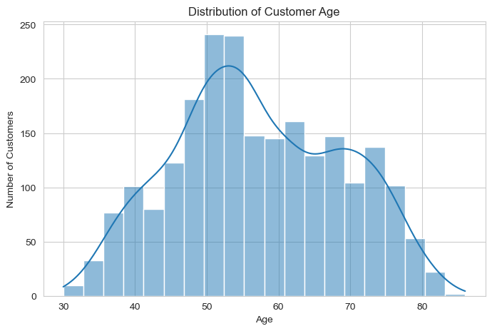
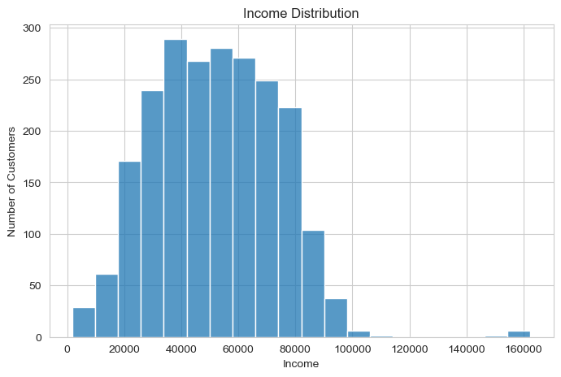
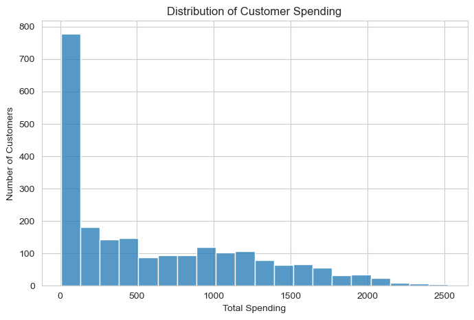
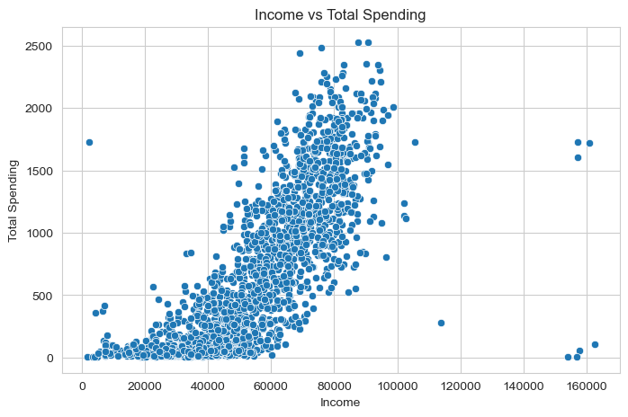
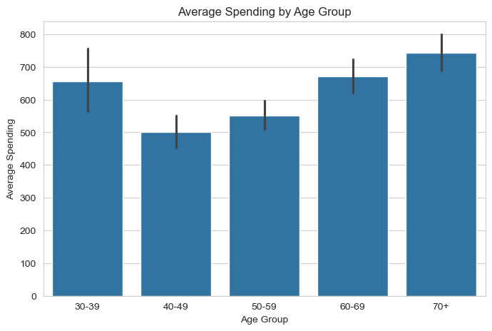
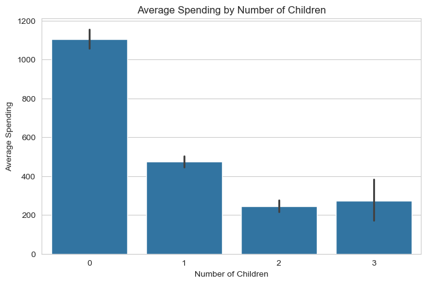
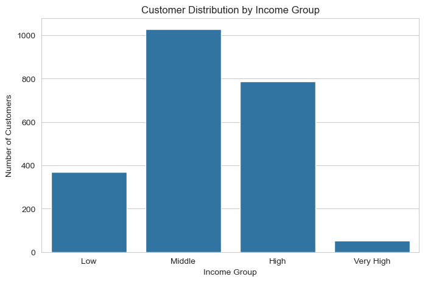

# 🛒 Pricing Psychology and Consumer Behavior Analysis

<div align="center">

## Understanding Customer Purchasing Behavior through Data Analytics and Business Intelligence

An end-to-end customer analytics project that explores how demographic characteristics, income, family size, and purchasing behavior influence consumer spending using **Python**, **Pandas**, **NumPy**, **Matplotlib**, and **Seaborn**. The project transforms customer transaction data into actionable business insights that support customer segmentation, targeted marketing, pricing strategy, and revenue optimization.


</div>

---

# 📊 Dashboard Preview

## 👥 Customer Age Distribution



---

## 💰 Customer Income Distribution



---

## 💵 Customer Spending Distribution



---

## 📈 Income vs Spending Relationship



---

## 👨‍👩‍👧 Spending by Age Group



---

## 👨‍👩‍👧‍👦 Average Spending by Family Size



---

## 💼 Spending by Income Group



---

# ✨ Project Highlights

- ✅ Customer Behavior Analytics
- ✅ Pricing Psychology Analysis
- ✅ Customer Segmentation
- ✅ Exploratory Data Analysis (EDA)
- ✅ Feature Engineering
- ✅ Statistical Analysis
- ✅ Business Intelligence Reporting
- ✅ Data Visualization
- ✅ Consumer Spending Analysis
- ✅ Marketing Insight Generation

---

# 📋 Project Information

| Item | Details |
|------|---------|
| **Project Type** | Customer Analytics |
| **Industry** | Retail / Marketing Analytics |
| **Dataset** | Marketing Campaign Dataset |
| **Records Analysed** | 2,240 Customer Records |
| **Programming Language** | Python |
| **Analysis Environment** | Jupyter Notebook |
| **Status** | Completed |
| **Author** | Emmanuel Origbo |

---

# 📖 Project Overview

Understanding why customers spend differently is one of the most valuable capabilities in modern business analytics. Organizations need to identify which customer characteristics influence purchasing decisions so they can optimize marketing campaigns, pricing strategies, and customer retention efforts.

This project investigates customer purchasing behavior by analyzing demographic characteristics such as age, income, education, marital status, family size, and purchasing activity. Through data preparation, exploratory data analysis, visualization, and statistical interpretation, the project uncovers spending patterns that can support evidence-based business decisions.

Rather than focusing only on descriptive statistics, the project emphasizes business interpretation by translating analytical findings into practical recommendations for marketing teams, pricing managers, and business decision-makers.

---

# 🎯 Business Problem

Businesses invest significant resources in marketing campaigns without always understanding which customer segments generate the highest business value.

Key business questions include:

- Which customers spend the most?
- Does customer income influence purchasing behavior?
- How does age affect spending?
- Does family size impact purchasing decisions?
- Which customer groups should receive premium offers?
- How can businesses improve customer targeting?

Answering these questions enables organizations to improve marketing efficiency while maximizing customer lifetime value.

---

# 🎯 Project Objectives

The primary objectives of this project are to:

- Analyze customer demographic characteristics
- Explore spending behavior across customer groups
- Identify high-value customer segments
- Examine relationships between income and spending
- Evaluate purchasing behavior by age and family size
- Generate actionable business insights
- Demonstrate an end-to-end customer analytics workflow

---

# 📦 Dataset

The analysis uses the **Marketing Campaign Dataset**, which contains demographic and purchasing information for over two thousand customers.

### Key Variables

- Customer ID
- Age
- Income
- Education
- Marital Status
- Number of Children
- Number of Teenagers
- Total Household Size
- Product Purchases
- Total Spending
- Purchase Frequency
- Campaign Responses

---

# 🧹 Data Preparation

Before analysis, the dataset was prepared through several preprocessing steps:

- Handling missing values
- Removing unnecessary variables
- Feature engineering
- Creating Age Groups
- Creating Income Groups
- Calculating Total Children
- Computing Total Spending
- Data type validation
- Data quality verification

The cleaned dataset provides a reliable foundation for customer analytics and visualization.

---

# 📊 Exploratory Data Analysis (EDA)

The exploratory analysis focuses on identifying spending patterns, customer characteristics, and relationships between demographic variables and purchasing behavior.

The analysis answers several important business questions:

- Which age group spends the most?
- Does higher income always translate to higher spending?
- Which income category generates the greatest customer value?
- How does household size influence purchasing behavior?
- Which customer segment should receive premium marketing campaigns?

---

# 📈 Data Visualizations

## 👥 Customer Age Distribution

This visualization illustrates the distribution of customer ages within the dataset.

**Business Insight**

- Most customers fall within the middle-age category.
- The customer base is concentrated among economically active individuals.
- Understanding age distribution helps organizations design age-specific marketing campaigns.


---

## 💰 Customer Income Distribution

This histogram illustrates the spread of customer income.

**Business Insight**

- Income varies considerably across customers.
- Most customers belong to middle-income categories.
- A relatively small number of customers earn exceptionally high incomes.


---

## 💵 Customer Spending Distribution

This visualization examines how spending is distributed across customers.

**Business Insight**

- Spending is not evenly distributed.
- A relatively small proportion of customers contributes a large share of revenue.
- High-spending customers represent valuable marketing targets.


---

## 📈 Income vs Spending Relationship

One of the most important analyses explores the relationship between customer income and spending.

**Business Insight**

- Customers with higher income generally spend more.
- Although income positively influences spending, purchasing behavior still varies considerably among customers with similar income levels.
- Other demographic variables also contribute to spending behavior.


---

## 👨‍👩‍👧 Spending by Age Group

Average customer spending across different age groups.

**Business Insight**

- Spending behavior differs noticeably across age categories.
- Some age groups contribute substantially more revenue than others.
- Age-based segmentation enables more personalized marketing campaigns.


---

## 👨‍👩‍👧‍👦 Average Spending by Family Size

Average spending grouped by household size.

**Business Insight**

- Household composition influences purchasing behavior.
- Families with children generally demonstrate different purchasing patterns compared to smaller households.
- Businesses can personalize product recommendations based on family size.


---

## 💼 Spending by Income Group

Average spending grouped according to customer income categories.

**Business Insight**

- Higher income groups consistently demonstrate greater purchasing power.
- Premium products and loyalty programs should prioritize these customer segments.
- Lower income groups may respond better to promotional pricing strategies.


---

# 💡 Executive Business Insights

The analysis generated several important business findings:

✅ Customer income is the strongest predictor of purchasing behavior.

✅ High-income customers consistently generate significantly greater revenue.

✅ Customer age influences spending, although the relationship is less pronounced than income.

✅ Household size affects purchasing patterns and product demand.

✅ Customer segmentation enables organizations to improve marketing efficiency.

✅ Pricing strategies should be adapted to different customer income groups.

✅ Personalized marketing campaigns are likely to produce higher conversion rates than generalized campaigns.

---

# 📈 Executive Recommendations

Based on the findings, organizations should consider the following strategies:

### 🎯 Customer Segmentation

Develop customer groups based on:

- Income
- Age
- Family Size
- Purchasing History

---

### 💎 Premium Customer Programs

Offer premium products and loyalty benefits to high-income, high-spending customers.

---

### 🎁 Personalized Promotions

Create customized promotional offers for different customer segments rather than using identical campaigns for all customers.

---

### 📢 Marketing Optimization

Allocate marketing budgets toward customer segments with the highest expected lifetime value.

---

### 📊 Data-Driven Decision Making

Use customer analytics continuously to monitor purchasing trends and refine pricing strategies.

---
# 🛠 Tools & Technologies

| Tool | Purpose |
|------|---------|
| Python | Programming Language |
| Pandas | Data Cleaning & Data Analysis |
| NumPy | Numerical Computing |
| Matplotlib | Data Visualization |
| Seaborn | Statistical Visualization |
| Jupyter Notebook | Interactive Analysis Environment |
| Git | Version Control |
| GitHub | Portfolio & Collaboration |

---

# 🤖 Machine Learning Readiness

Although this project focuses on **descriptive analytics** rather than predictive modeling, the cleaned dataset and engineered features provide an excellent foundation for future machine learning applications.

Potential models that could be developed include:

- Customer Spending Prediction
- Customer Lifetime Value (CLV) Estimation
- Customer Segmentation using K-Means Clustering
- Purchase Propensity Prediction
- Campaign Response Prediction
- Customer Churn Prediction

This demonstrates how business analytics projects can naturally evolve into machine learning solutions.

---

# 📂 Repository Structure

```text
Pricing-Psychology-And-Consumer-Behavior-Analysis/
│
├── data/
│   └── marketing_campaign.csv
│
├── notebooks/
│   └── Pricing_Psychology_and_Consumer_Behavior_Analysis.ipynb
│
├── screenshots/
│   ├── age_distribution.png
│   ├── income_distribution.png
│   ├── spending_distribution.png
│   ├── income_vs_spending.png
│   ├── spending_by_age_group.png
│   ├── spending_by_family_size.png
│   └── spending_by_income_group.png
│
├── README.md
└── .gitignore
```

---

# 🚀 Skills Demonstrated

This project demonstrates proficiency in:

- Customer Analytics
- Business Analytics
- Consumer Behavior Analysis
- Pricing Psychology
- Python Programming
- Data Cleaning
- Feature Engineering
- Exploratory Data Analysis (EDA)
- Statistical Analysis
- Data Visualization
- Business Intelligence
- Marketing Analytics
- Business Storytelling
- Insight Generation
- Analytical Thinking

---

# 📈 Business Value

The analytical workflow demonstrated in this project enables organizations to:

- Understand customer purchasing behavior
- Identify high-value customer segments
- Improve marketing campaign effectiveness
- Optimize pricing strategies
- Increase customer retention
- Support strategic decision-making
- Personalize customer experiences
- Improve return on marketing investment (ROMI)

---

# 🔮 Future Improvements

Future enhancements could include:

- Interactive Power BI Dashboard
- Tableau Dashboard
- Customer Segmentation with Machine Learning
- Predictive Customer Spending Models
- Customer Lifetime Value (CLV) Analysis
- Campaign Performance Prediction
- Interactive Streamlit Application
- SQL Database Integration
- Automated Reporting Pipeline
- Real-Time Customer Analytics

---

# ▶️ Installation

Clone the repository:

```bash
git clone https://github.com/origboemma/Pricing-Psychology-And-Consumer-Behavior-Analysis.git
```

Navigate to the project directory:

```bash
cd Pricing-Psychology-And-Consumer-Behavior-Analysis
```

Install the required libraries:

```bash
pip install pandas numpy matplotlib seaborn jupyter
```

---

# ▶️ Usage

Launch Jupyter Notebook:

```bash
jupyter notebook
```

Open:

```text
Pricing_Psychology_and_Consumer_Behavior_Analysis.ipynb
```

Run all notebook cells sequentially to reproduce the complete analysis, visualizations, and business insights.

---

# 👨‍💻 Author

**Emmanuel Origbo**

Aspiring Data Analyst | Business Analyst | Python Developer

**GitHub:** https://github.com/origboemma

**LinkedIn:** https://www.linkedin.com/in/origboemma

---

# 📄 License

This repository is shared for **educational and professional portfolio purposes**.

The project demonstrates practical applications of customer analytics, exploratory data analysis, and business intelligence using publicly available educational datasets.

---

# 🤝 Connect with Me

Thank you for taking the time to explore this project.

If you have feedback, collaboration opportunities, or questions related to **Data Analytics, Business Analytics, Customer Analytics, Business Intelligence, Marketing Analytics, or Python**, feel free to connect with me through **GitHub** or **LinkedIn**.

I am always open to discussing data-driven solutions, analytics projects, and opportunities to solve real-world business problems through data.

---
